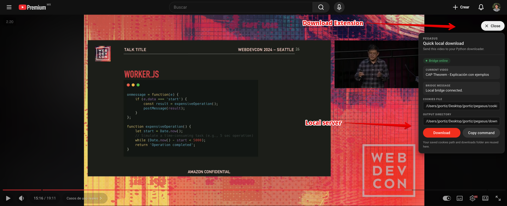

# Youtube Download Extension

<p align="center">
  
</p>

**Local-first YouTube downloader.** A Python bridge + Chrome extension that lets you download any YouTube video up to 1080p directly to your machine. No cloud, no subscription.

[](LICENSE)
[](https://www.python.org/)
[](https://nodejs.org/)

---

## How It Works

```
YouTube page  →  Chrome extension  →  Local bridge (127.0.0.1:8765)  →  yt-dlp  →  your disk
```

<p align="center">
  
</p>

The extension injects a **Download** button into every YouTube watch page. When clicked, it sends the video URL to a small Python HTTP server running on your machine. The server downloads the video using `yt-dlp` and streams progress back to the extension in real time.

---

## Features

- Download any YouTube video up to **1080p** (best video + best audio merged to MP4)
- Real-time **progress bar** in the browser
- Works with **age-restricted or member-only** videos via your browser cookies
- **Copy command** fallback - copies the equivalent CLI command to your clipboard
- YouTube-native UI - matches YouTube's own color palette, typography, and button shapes
- Full **dark mode** support
- Completely **local** - no data leaves your machine

---

## Requirements

Before you start, make sure these prerequisites are installed on your machine:

| Tool | Version | Install |
|------|---------|---------|
| Python | 3.11+ | [python.org](https://www.python.org/) |
| ffmpeg | any | `brew install ffmpeg` / `apt install ffmpeg` |
| Node.js | 18+ | [nodejs.org](https://nodejs.org/) |
| Chrome / Chromium | any | [chrome.com](https://www.google.com/chrome/) |
| Cookie Editor | any | [Chrome Web Store](https://chromewebstore.google.com/detail/cookie-editor/hlkenndednhfkekhgcdicdfddnkalmdm) |

### Required prerequisites

- `Python 3.11+` is required for the Python bridge and CLI
- `Node.js 18+` is required to build the Chrome extension
- `ffmpeg` is required so `yt-dlp` can merge video and audio into a single file

Quick checks:

```bash
python3.11 --version
node --version
ffmpeg -version
```

---

## Setup

### 1 - Python bridge

```bash
# Clone the repo
git clone https://github.com/misterpoloy/youtube-download-extension.git
cd youtube-download-extension

# Create and activate a virtual environment with Python 3.11
python3.11 -m venv .venv
source .venv/bin/activate        # Windows: .venv\Scripts\activate

# Install dependencies
pip install yt-dlp

# Start the bridge
python -m youtube_downloader.bridge
# → Bridge listening on http://127.0.0.1:8765
```

Keep this terminal running while you use the extension.

### 2 - Chrome extension

```bash
cd browser_extension
npm install
npm run build
```

Then in Chrome:

1. Go to `chrome://extensions`
2. Enable **Developer mode**
3. Click **Load unpacked**
4. Select the `browser_extension/dist/` folder

### 3 - Configure

Click the Pegasus toolbar icon and set:

- **Bridge URL** - `http://127.0.0.1:8765` (default)
- **Cookies file** - absolute path to your `cookies.txt` (optional, needed for restricted videos)
- **Output directory** - absolute path to your downloads folder

### 4 - Download

Open any YouTube video, click the **Download** button in the top-right corner of the page, and hit **Download** in the panel.

---

## CLI Usage

You can also use the downloader directly from the terminal without the extension.

```bash
source .venv/bin/activate

# Download a single video
python -m youtube_downloader.cli "https://www.youtube.com/watch?v=VIDEO_ID"

# Choose an output folder
python -m youtube_downloader.cli "URL" --output-dir ~/Downloads

# Pass cookies for restricted videos
python -m youtube_downloader.cli "URL" --cookies /path/to/cookies.txt

# Download multiple URLs
python -m youtube_downloader.cli "URL_1" "URL_2"
```

### Getting cookies

YouTube requires authentication cookies to download most videos. Without them you will get `HTTP Error 403: Forbidden`.

**Option A - Export cookies with Cookie Editor (recommended)**

1. Install [Cookie Editor](https://chromewebstore.google.com/detail/cookie-editor/hlkenndednhfkekhgcdicdfddnkalmdm) from the Chrome Web Store.
2. Go to [youtube.com](https://www.youtube.com) and make sure you are logged in.
3. Click the Cookie Editor icon in the toolbar.
4. Click **Export** → choose **Netscape / HTTP Cookie File** format.
5. Save the file somewhere on your machine (e.g. `~/cookies.txt`).

**Option B - Use browser cookies directly (CLI only)**

```bash
python -m youtube_downloader.cli --cookies-from-browser chrome "URL"
```

This reads cookies straight from your Chrome profile. No export step needed, but only works with the CLI — the extension UI requires a file path.

**Using cookies with the CLI:**

```bash
python -m youtube_downloader.cli --cookies /absolute/path/to/cookies.txt "URL"
```

**Using cookies with the extension:**

Click the toolbar icon and paste the **absolute path** to your `cookies.txt` file in the **Cookies file** field (e.g. `/Users/you/cookies.txt`).

> **Never commit your cookies file.** It is listed in `.gitignore` and contains active session tokens.

---

## Architecture

```
youtube-download-extension/
├── youtube_downloader/
│   ├── cli.py          # CLI - wraps yt-dlp, handles format selection
│   └── bridge.py       # HTTP bridge - ThreadingHTTPServer, job queue
├── browser_extension/
│   ├── src/
│   │   ├── background.ts       # Service worker - proxies messages to bridge
│   │   ├── content/main.ts     # YouTube page injection - floating panel
│   │   ├── popup/App.tsx       # Settings popup (React)
│   │   └── shared/             # Types, storage, bridge client
│   └── public/manifest.json
└── .github/workflows/ci.yml
```

### Bridge API

| Method | Path | Description |
|--------|------|-------------|
| `GET` | `/health` | Liveness check |
| `POST` | `/download` | Start a download job |
| `GET` | `/jobs/{id}` | Poll job status and progress |

---

## Development

See [CONTRIBUTING.md](CONTRIBUTING.md) for full setup instructions, code style, and how to submit pull requests.

**Quick lint check:**

```bash
# Python
ruff check youtube_downloader/

# TypeScript
cd browser_extension && npm run lint
```

---

## License

MIT - see [LICENSE](LICENSE).
